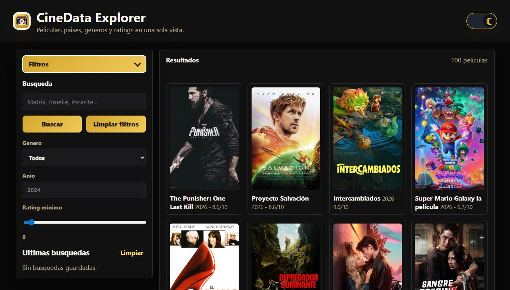
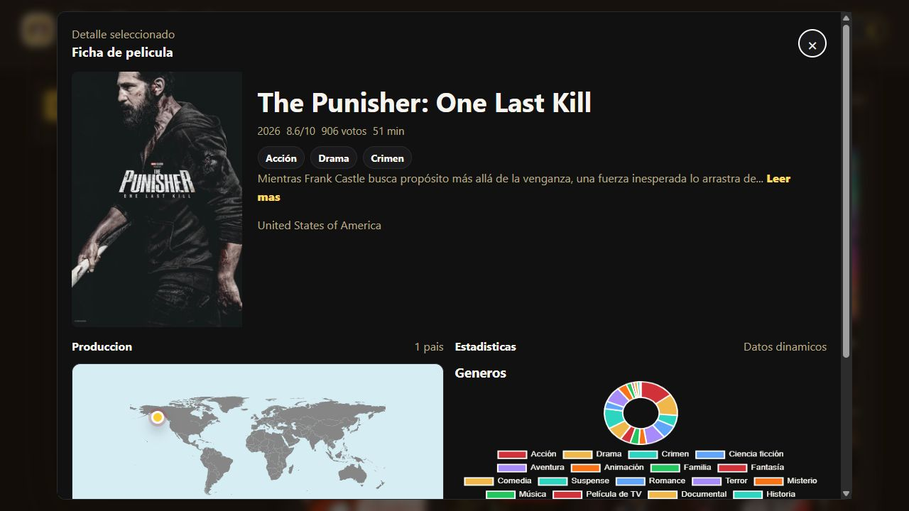
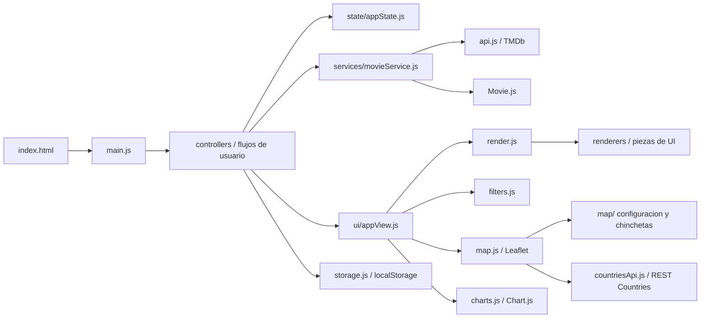

# CineData Explorer

<p align="center">
  
</p>

CineData Explorer es una aplicacion web interactiva para buscar peliculas con TheMovieDB, explorar sus paises de produccion en un mapa Leaflet y analizar generos y popularidad mediante graficas Chart.js.

La app esta pensada como proyecto integrador de JavaScript avanzado: usa modulos ES6, `async/await`, clases, funciones puras, persistencia en `localStorage`, filtros, tema claro/oscuro y una interfaz responsive preparada para GitHub Pages.

## Branding

La guia de marca para adaptar la app a la paleta visual de The Bridge esta en [`BRANDING_GUIDE.md`](./BRANDING_GUIDE.md).

## Capturas

### Vista principal



### Modal de detalle



## Funcionalidades

- Busqueda de peliculas con `debounce` para evitar peticiones excesivas.
- Consumo de TheMovieDB con `fetch`, `async/await`, `try/catch` y `AbortController`.
- Clase `Movie` para normalizar peliculas y centralizar datos derivados.
- Filtros por genero, anio y rating minimo mediante funciones puras.
- Historial de las ultimas 10 busquedas guardado en `localStorage`.
- Modo claro/oscuro persistido entre sesiones.
- Paginacion de resultados con el boton `Cargar mas peliculas`.
- Modal centrado con ficha completa de la pelicula seleccionada.
- Mapa Leaflet 1.9 con chinchetas de los paises de produccion.
- Grafica doughnut de generos y grafica de barras de popularidad con Chart.js.
- Interfaz responsive con HTML semantico y estados accesibles.

## Arquitectura

La aplicacion esta separada por responsabilidades para que cada archivo tenga una funcion clara:

```text
cineData/
  index.html
  README.md
  BRANDING_GUIDE.md
  css/
    styles.css
  img/
    logo.svg
    capturas/
      home.png
      modal-detalle.png
  js/
    controllers/
      detailController.js
      eventsController.js
      filterController.js
      searchController.js
      themeController.js
    services/
      movieService.js
    settings/
      appSettings.js
    state/
      appState.js
    ui/
      appView.js
    renderers/
      countryRenderer.js
      detailRenderer.js
      filterRenderer.js
      historyRenderer.js
      posterMarkup.js
      resultsRenderer.js
    map/
      mapConfig.js
      mapProjection.js
      pinLayer.js
      productionIcon.js
    api.js
    charts.js
    config.example.js
    config.js
    countriesApi.js
    dom.js
    filters.js
    main.js
    map.js
    Movie.js
    render.js
    storage.js
    utils.js
```



## Modulos clave

- `main.js`: punto de entrada; inicializa tema, mapa, graficas, eventos y datos remotos.
- `controllers/`: orquesta acciones de usuario: busqueda, filtros, detalle, tema y eventos del DOM.
- `services/movieService.js`: traduce peticiones de TMDb a objetos `Movie` y encapsula cache de detalle.
- `state/appState.js`: estado unico de la aplicacion y operaciones basicas sobre colecciones de peliculas.
- `ui/appView.js`: funciones de vista que conectan renderizado, graficas, mensajes y refrescos visuales.
- `renderers/`: piezas de presentacion separadas por zona: resultados, detalle, historial, filtros y paises.
- `map/`: helpers del mapa para constantes, proyeccion, iconos y capa HTML de chinchetas.
- `settings/appSettings.js`: constantes de negocio como limite inicial de peliculas y longitud minima de busqueda.
- `api.js`: capa unica de acceso a TheMovieDB; centraliza URL base, idioma, API key y errores.
- `Movie.js`: clase de dominio que convierte la respuesta de TMDb en un objeto estable para toda la UI.
- `filters.js`: funciones puras para filtrar por genero, anio y rating, y preparar datasets.
- `render.js`: barril de exportaciones para mantener imports simples hacia `renderers/`.
- `map.js`: inicializacion y actualizacion del mapa Leaflet con chinchetas de produccion.
- `charts.js`: inicializacion y actualizacion de las graficas de genero y popularidad.
- `countriesApi.js`: obtencion de coordenadas por codigo ISO con cache y fallback local.
- `storage.js`: lectura/escritura defensiva en `localStorage`.
- `utils.js`: utilidades compartidas como `debounce`, formateadores y `escapeHtml`.

## Flujo de uso

1. La app carga generos y peliculas populares al iniciar.
2. El usuario busca una pelicula o ajusta filtros.
3. Un controlador actualiza `state/appState.js` y delega el repintado en `ui/appView.js`.
4. Al seleccionar una pelicula, `detailController.js` pide el detalle completo a TMDb.
5. `movieService.js` transforma la respuesta en una instancia de `Movie`.
6. El modal muestra ficha, paises, mapa Leaflet y graficas Chart.js.
7. El historial y el tema se conservan en `localStorage`.

## Decisiones tecnicas para defender

- **Modulos ES6:** el codigo esta dividido por responsabilidad y se importa solo lo necesario.
- **Clase `Movie`:** encapsula datos derivados como `year`, `posterUrl`, `genreNames` y `formattedRating`.
- **Funciones puras:** los filtros no modifican el array original, devuelven nuevas colecciones.
- **`AbortController`:** cancela busquedas o detalles anteriores para evitar resultados desordenados.
- **Cache en memoria:** el detalle de una pelicula se guarda en `detailCache` para no repetir llamadas.
- **`localStorage`:** persiste historial, tema y cache de coordenadas sin backend.
- **Leaflet + REST Countries:** convierte paises de produccion en puntos visibles sobre un mapa mundial.
- **Chart.js:** transforma los resultados filtrados en graficas actualizadas en tiempo real.
- **`escapeHtml`:** sanea texto externo antes de insertarlo como HTML.
- **Responsive design:** la interfaz pasa a una columna en pantallas pequenas.

## Configuracion de TheMovieDB

La app necesita una API key de TheMovieDB para cargar datos reales.

1. Crea una cuenta gratuita en TheMovieDB.
2. Genera una API key.
3. Copia `js/config.example.js` como referencia.
4. Crea o edita `js/config.js`:

```js
export const TMDB_API_KEY = "TU_API_KEY_AQUI";
```

Tambien puedes guardar una clave solo en tu navegador para una demo local:

```js
localStorage.setItem("cinedata:tmdb-api-key", "TU_API_KEY_AQUI");
```

Despues recarga la pagina.

> Nota: al ser una aplicacion frontend estatica, cualquier clave usada desde el navegador debe considerarse publica. Para una entrega real, conviene usar una clave restringida o de pruebas.

## Uso local

Abre una terminal en la carpeta `cineData/` y levanta un servidor estatico:

```bash
python -m http.server 5500
```

Despues abre:

```text
http://localhost:5500
```

Tambien puedes usar la extension Live Server de VS Code.

## Despliegue en GitHub Pages

1. Sube el proyecto al repositorio.
2. En GitHub, entra en `Settings > Pages`.
3. Selecciona la rama y la carpeta donde esta `index.html`.
4. Publica la URL generada en la entrega o Pull Request.

## Checklist de requisitos

- [x] JavaScript moderno con modulos ES6.
- [x] `async/await` y `try/catch`.
- [x] Clase `Movie`.
- [x] Funciones puras para filtros y transformaciones.
- [x] Buscador con `debounce`.
- [x] Consumo de API externa con `fetch`.
- [x] Mapa Leaflet con chinchetas.
- [x] Grafica doughnut de generos con Chart.js.
- [x] Grafica adicional de popularidad.
- [x] `localStorage` para historial, tema y cache.
- [x] HTML semantico y CSS responsive.
- [x] Preparada para GitHub Pages.

## Guion rapido de defensa

1. **Objetivo:** "CineData Explorer permite buscar peliculas y cruzar datos de cine con paises, generos y popularidad."
2. **Arquitectura:** "La app separa entrada, controladores, servicios, estado, vistas, renderizadores, API y persistencia."
3. **JavaScript avanzado:** "Uso `async/await`, `AbortController`, clase `Movie`, funciones puras y `localStorage`."
4. **Visualizacion:** "Leaflet muestra paises de produccion y Chart.js resume generos y popularidad."
5. **Experiencia de usuario:** "Tiene tema persistente, filtros, historial, modal accesible y diseno responsive."
6. **Mejora futura:** "El siguiente paso seria mover la API key a un backend o proxy para no exponerla en frontend."

## Logo

El logotipo esta en `img/logo.svg` y representa las tres ideas centrales del proyecto: cine, datos y exploracion geografica. Se usa en la cabecera de la app y tambien como favicon.
